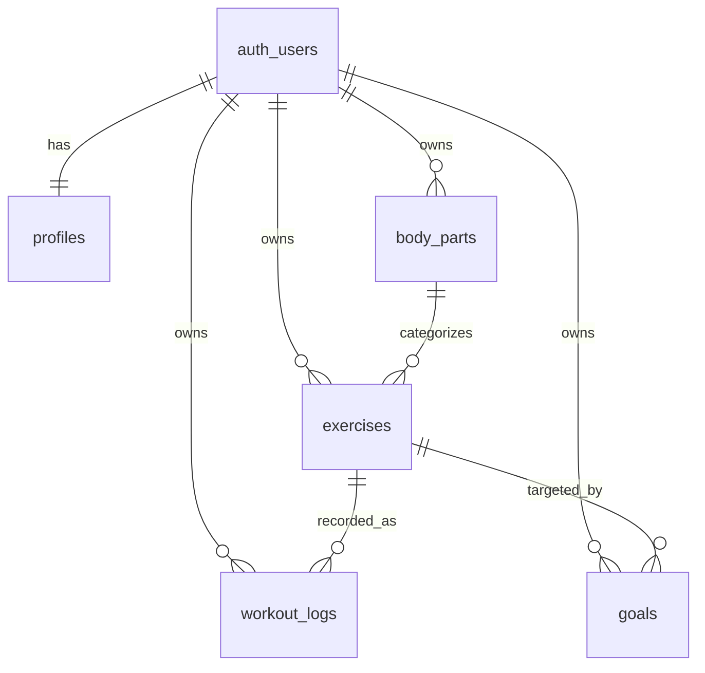

# Workout Log

Workout Log は、日々のトレーニング記録、種目管理、目標重量、ダッシュボード分析をまとめて扱うWebアプリです。

Next.js App Router、TypeScript、styled-components、Supabase Auth / Database を使い、ポートフォリオとして設計意図や実装方針を説明しやすい構成を意識して作成しています。

## 作成意図

トレーニング記録アプリは、CRUD、認証、集計、グラフ表示、レスポンシブUIなど、Webアプリ開発でよく使う要素を自然に含みます。

このリポジトリでは、単に画面を作るだけでなく、以下を重視しています。

- 機能単位で責務を分けたディレクトリ構成
- Server Components / Client Components の境界整理
- Supabase RLS を前提にしたユーザーごとのデータ分離
- Zod と TypeScript による入力値・DB境界の型安全性
- styled-components による小さなUIプリミティブの積み上げ
- 集計ロジックや表示コンポーネントのテスト

## 主な機能

- メールアドレスとパスワードによるログイン / ログアウト
- 未ログイン時の認証ページへのリダイレクト
- 部位の作成・編集・削除
- 種目の作成・編集・削除
- 部位による種目フィルタリング
- トレーニング記録の作成・編集・削除
- 日付・種目による記録フィルタリング
- 種目ごとの目標重量設定
- 現在の最大重量と目標重量からの達成率表示
- 週間・月間のトレーニング頻度サマリー
- 総ボリュームの集計
- 種目別の重量推移グラフ
- 週間・月間の頻度グラフ
- 直近30日間の総ボリューム推移グラフ
- PC / SP に対応したアプリレイアウト
- 空状態・ローディング状態の表示

## 技術スタック

| 領域            | 使用技術                         |
| --------------- | -------------------------------- |
| フレームワーク  | Next.js App Router               |
| 言語            | TypeScript                       |
| UI              | React, styled-components         |
| グラフ          | Recharts                         |
| バックエンド    | Supabase Auth, Supabase Database |
| バリデーション  | Zod                              |
| テスト          | Jest, React Testing Library      |
| 静的解析 / 整形 | ESLint, Prettier                 |
| デプロイ想定    | Vercel                           |

### 技術選定の理由

Next.js App Router は、認証後のアプリ画面と公開ページを同じリポジトリで扱いやすく、Server Components を使ってデータ取得の責務をページ側に寄せやすいため採用しています。

Supabase は Auth、PostgreSQL、RLS をまとめて扱えるため、小さな個人開発アプリでもユーザーごとのデータ分離を実装しやすい点を重視しました。

UI は Tailwind CSS や shadcn/ui を使わず、styled-components で小さなプリミティブを作っています。デザイントークンを `lib/styles/theme.ts` に集約し、ボタン、カード、フォーム、空状態、ローディング表示などをアプリ内で再利用できる形にしています。

## アプリ構成

```txt
app/
  (auth)/
    login/
  (app)/
    dashboard/
    exercises/
    goals/
    workouts/
components/
  layout/
  primitives/
features/
  auth/
  dashboard/
  exercises/
  goals/
  workouts/
lib/
  styles/
  supabase/
supabase/
  migrations/
types/
  database.ts
```

ページコンポーネントは薄く保ち、実際のUI、Server Actions、集計ロジック、型定義、テストは `features/` 配下に機能単位でまとめています。

## 画面

| パス         | 内容                                         |
| ------------ | -------------------------------------------- |
| `/`          | アプリの概要を伝えるトップページ             |
| `/login`     | ログイン画面                                 |
| `/dashboard` | 頻度、総ボリューム、目標達成率、グラフの確認 |
| `/workouts`  | トレーニング記録の作成・一覧・編集・削除     |
| `/exercises` | 部位と種目の管理                             |
| `/goals`     | 種目ごとの目標重量と達成率の管理             |

`/dashboard`、`/workouts`、`/exercises`、`/goals` はログイン後にアクセスする画面です。未ログインの場合は `/login` にリダイレクトします。

## テーブル設計



### profiles

| カラム         | 説明                       |
| -------------- | -------------------------- |
| `id`           | Supabase Auth のユーザーID |
| `display_name` | 表示名                     |
| `created_at`   | 作成日時                   |

### body_parts

| カラム       | 説明           |
| ------------ | -------------- |
| `id`         | 部位ID         |
| `user_id`    | 所有ユーザーID |
| `name`       | 部位名         |
| `created_at` | 作成日時       |

### exercises

| カラム         | 説明           |
| -------------- | -------------- |
| `id`           | 種目ID         |
| `user_id`      | 所有ユーザーID |
| `body_part_id` | 紐づく部位ID   |
| `name`         | 種目名         |
| `created_at`   | 作成日時       |
| `updated_at`   | 更新日時       |

### workout_logs

| カラム        | 説明           |
| ------------- | -------------- |
| `id`          | 記録ID         |
| `user_id`     | 所有ユーザーID |
| `exercise_id` | 紐づく種目ID   |
| `trained_at`  | トレーニング日 |
| `weight`      | 重量           |
| `sets`        | セット数       |
| `reps`        | 回数           |
| `memo`        | メモ           |
| `created_at`  | 作成日時       |
| `updated_at`  | 更新日時       |

### goals

| カラム          | 説明           |
| --------------- | -------------- |
| `id`            | 目標ID         |
| `user_id`       | 所有ユーザーID |
| `exercise_id`   | 紐づく種目ID   |
| `target_weight` | 目標重量       |
| `created_at`    | 作成日時       |
| `updated_at`    | 更新日時       |

全テーブルで Row Level Security を有効化し、`user_id = auth.uid()` の行のみ操作できるようにしています。`exercises`、`workout_logs`、`goals` では、関連する部位・種目が同じユーザーに属していることもトリガーで検証します。

## セットアップ

### 1. 依存関係のインストール

```bash
npm install
```

### 2. 環境変数の設定

`.env.example` をもとに `.env.local` を作成します。

```bash
cp .env.example .env.local
```

`.env.local` に Supabase の値を設定します。

```env
NEXT_PUBLIC_SUPABASE_URL=
NEXT_PUBLIC_SUPABASE_PUBLISHABLE_KEY=
```

`NEXT_PUBLIC_SUPABASE_ANON_KEY` も読み込めますが、新規設定では `NEXT_PUBLIC_SUPABASE_PUBLISHABLE_KEY` を優先します。

### 3. Supabase の設定

Supabase プロジェクトを作成し、Authentication の Email / Password を有効にします。

その後、`supabase/migrations/` 配下のSQLを番号順に適用します。

```txt
20260603000100_create_profiles.sql
20260603000200_create_body_parts_and_exercises.sql
20260603000300_create_workout_logs.sql
20260603000400_create_goals.sql
20260603000500_create_rls_policies.sql
```

Supabase CLI を使う場合は、プロジェクトと接続したうえで migration を適用してください。CLI を使わない場合は、Supabase Dashboard の SQL Editor から順番に実行できます。

### 4. 開発サーバーの起動

```bash
npm run dev
```

ブラウザで `http://localhost:3000` を開きます。

## 利用できるスクリプト

```bash
npm run dev
npm run build
npm run start
npm run lint
npm run format
npm run format:check
npm run typecheck
npm test
```

## テスト

このリポジトリでは、以下を中心にテストしています。

- フォーム入力のバリデーション
- 認証UIの表示
- トレーニング記録フォームと一覧UI
- 総ボリューム計算
- 目標達成率計算
- ダッシュボードのサマリー集計
- ダッシュボードグラフ用のデータ整形
- 表示コンポーネントの空状態や主要要素

開発時の確認コマンドは以下です。

```bash
npm run format:check
npm run lint
npm run typecheck
npm test
npm run build
```
